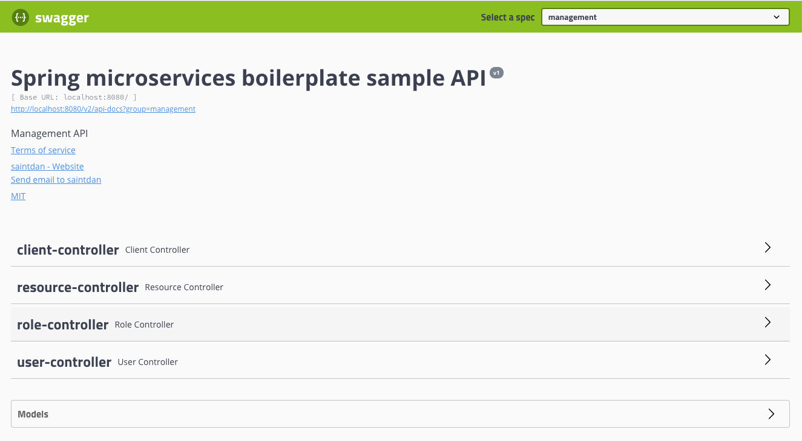
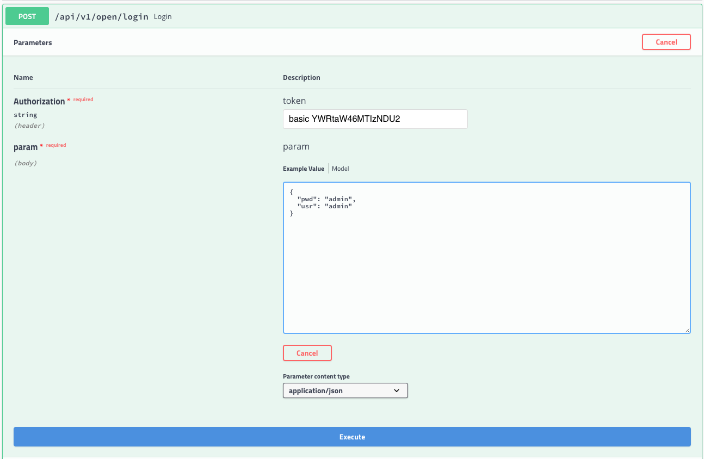
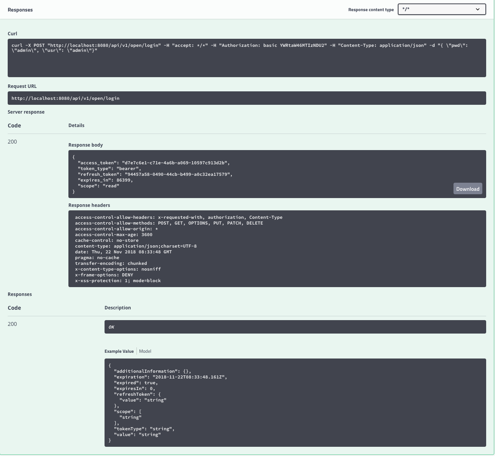
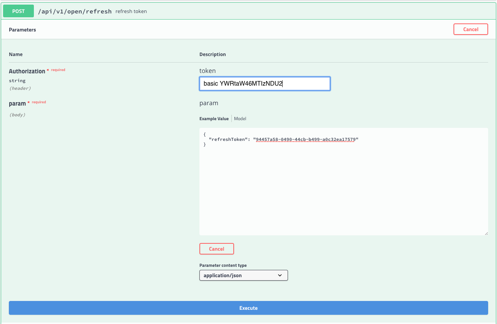
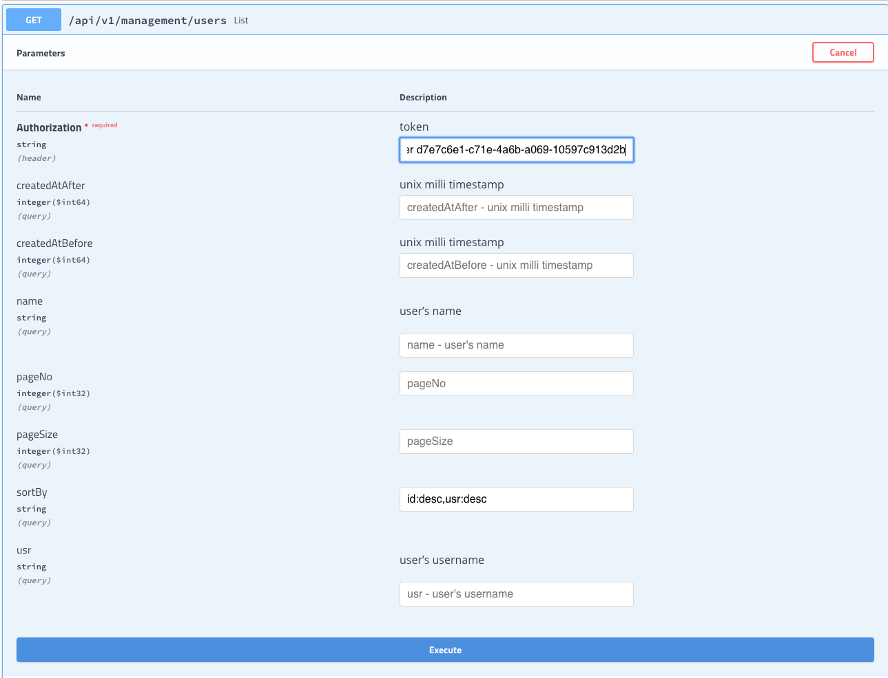
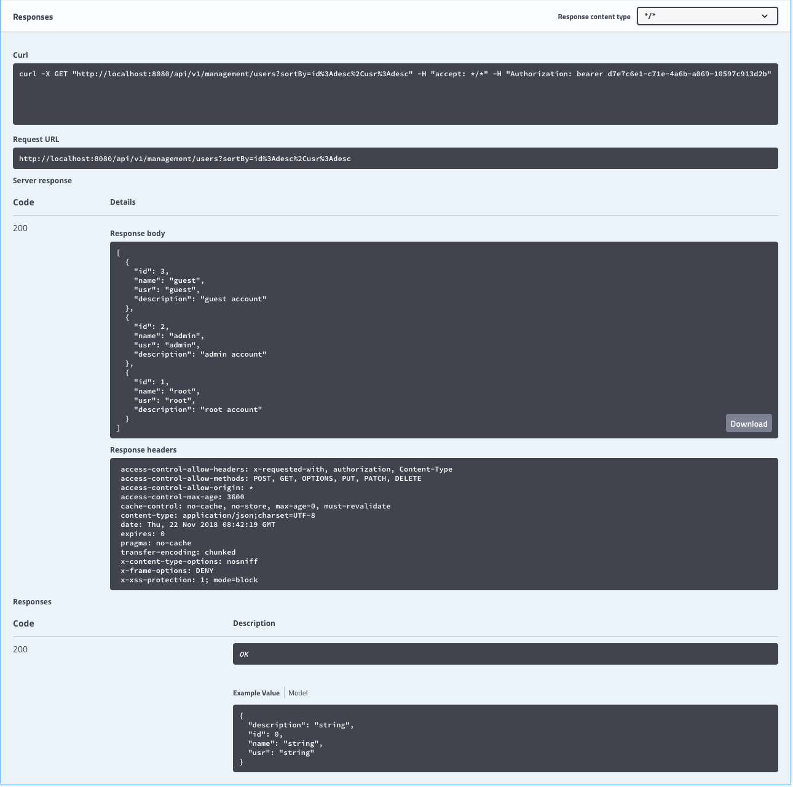

# spring-microservices-boilerplate

[中文版](README_zh.md)

## <a name="index"></a>Index

- [Build and Run](#build)
- [NOTICE](#notice)
- [Usage](#usage)
  - [Import init.sql](#init)
  - [Access resources with Swagger](#swagger)
- [Deploy](#deploy)
- [License](#license)
- [Version History](#version)

**spring-microservices-boilerplate** is a boilerplate which is very helpful for java programmer and friendly to front end.

And build with:

- [Spring Boot](http://projects.spring.io/spring-boot/)
- [Spring OAuth 2](http://projects.spring.io/spring-security-oauth/)
- [Spring Security](http://projects.spring.io/spring-security/)
- [Spring Data JPA](http://projects.spring.io/spring-data-jpa/)

And use [specification-arg-resolver](https://github.com/tkaczmarzyk/specification-arg-resolver) for filter.

> NOTE If you need RSA sign check, you can use `validateWithSignCheck` of [ValidateHelper](src/main/java/com/saintdan/framework/component/ValidateHelper.java)

## <a name="build"></a>Build and Run [[TOP]](#index)

```
$ cd <spring-microservices-boilerplate root path>
$ ./gradlew clean build bootRun
```

## <a name="notice"></a>NOTICE [[TOP]](#index)

- Validate failed -> Response http status is **422**(Unprocessable Entity)
- Server error -> Response http status is **500**(Internal Server Error)

## <a name="usage"></a>Usage [[TOP]](#index)

### <a name="init"></a>Step 1: Import the [init.sql](src/main/resources/init.sql) to your database, I suggest you to use [PostgreSQL](https://www.postgresql.org/) [[TOP]](#index)

### <a name="swagger"></a>Step 2: Access resources with Swagger. [[TOP]](#index)

Run it, Open your browser and access [http://localhost:8080/swagger-ui.html#/](http://localhost:8080/swagger-ui.html#/).
> **NOTE** Default port is 8080, you can modify it which key is `server.port` in [application.yml](src/main/resources/application.yml).

and then:



You can test API by the tips.

1. Get `access_token` and `refresh_token` with login API.

and result is:

2. Or get new `access_token` with `refresh_token`.

3. Access users.

and result is:


### <a name="deploy"></a>Deploy [[TOP]](#index)

1. Build **war** and use tomcat.
2. Build **jar** and run `java -jar foo.jar`
3. Use **Docker**. You can build your docker image by [Dockerfile](Dockerfile). And run it with [docker-compose.yml](docker-compose.yml).

## <a name="license"></a>License [[TOP]](#index)

**[MIT](http://opensource.org/licenses/MIT)**

Copyright (c) since 2015 saintdan

## <a name="version"></a>Version History [[TOP]](#index)

[Version history is here. ;)](VERSION_HISTORY.md)